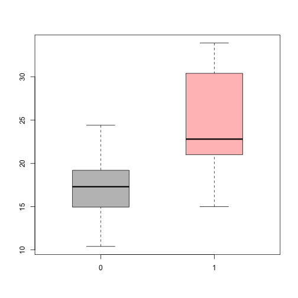

# Overview

|  |   |
| ---:| --- |
| **Name**> | My Shiny App - (MSA) |
| **Audience**>  | For car enthousiasts |
| **Dataset**> | `mtcars` |
| **Purpose**> | Analyze the relationship between multiple variables (**e.g.** *mpg*, *transmission*) and how are they correlated |
| **Link**> | [Try it here](https://rgeos.shinyapps.io/DataProducts/) - the link will open in a new window |

---

# Control Panel

This is a sample screen shot from the app.  
From the drop down menu choose `Miles Per Gallon` and use as predictor the `Transmission` as shown in the picture below:
![alt text][pic]

[pic]: libraries/pics/ScreenShot0.png "Screen Shot"

--- .class1  #id bg:yellow

# Main Panel


The application will printout a short summary of the selected variables. We will show only one of it below.


```r
summary(mtcars$mpg)
```

```
##    Min. 1st Qu.  Median    Mean 3rd Qu.    Max. 
##   10.40   15.42   19.20   20.09   22.80   33.90
```

---

# Plot Panel

It will also make some plots as the box plots shown below.
 

---

# Plot Panel (cont)


If you chose to show the plots for the regression model, the app will use these variables`list, mpg, wt, qsec, am`.

Scroll down the page and you will be able to see the plots related to the regression model.

> **ENJOY**
